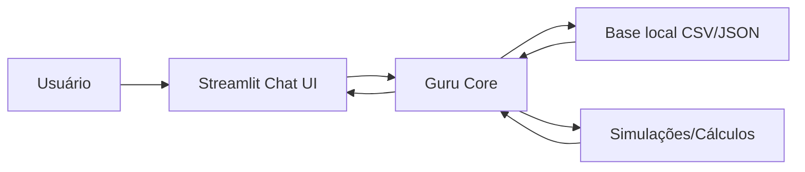

# 🤖 Guru — Agente Financeiro com IA Generativa

**Guru** é um assistente financeiro com IA focado em **planejamento de metas**, **explicação de produtos** e **simulações simples**, com respostas **contextualizadas** a partir de uma base local (CSV/JSON) e com **mecanismos anti-alucinação**.

> ⚠️ Conteúdo educacional. Não é recomendação financeira formal.

---

### Tela principal do Guru


---

## 🚀 Principais funcionalidades

- ✅ Chat em linguagem natural (Streamlit)
- ✅ Contexto do cliente via `perfil_investidor.json`
- ✅ Recomendação de produtos compatível com perfil/risco (base local)
- ✅ Simulações determinísticas (ex.: quanto falta para reserva / quanto guardar por mês)
- ✅ Respostas seguras: se o dado não estiver na base, o Guru não inventa

---

## 🧠 Como o Guru evita alucinações

- O Guru **só afirma fatos do cliente** se estiverem na base local (CSV/JSON).
- Quando falta informação, responde: **“Não tenho essa informação na minha base.”**
- Cálculos são feitos por funções determinísticas em Python (sem “chute” da IA).
- Explicações de produtos se limitam ao catálogo `produtos_financeiros.json`.

---

## 🏗️ Arquitetura (alto nível)


---

## Estrutura do Repositório

```
📁 lab-agente-financeiro/
│
├── 📄 README.md
├── 📄 requirements.txt
├── 📄 .env
│
├── 📁 data/                          # Dados mockados para o agente
│   ├── historico_atendimento.csv     # Histórico de atendimentos (CSV)
│   ├── perfil_investidor.json        # Perfil do cliente (JSON)
│   ├── produtos_financeiros.json     # Produtos disponíveis (JSON)
│   └── transacoes.csv                # Histórico de transações (CSV)
│
├── 📁 docs/                          # Documentação do projeto
│   ├── 01-documentacao-agente.md     # Caso de uso e arquitetura
│   ├── 02-base-conhecimento.md       # Estratégia de dados
│   ├── 03-prompts.md                 # Engenharia de prompts
│   ├── 04-metricas.md                # Avaliação e métricas
│   └── 05-pitch.md                   # Roteiro do pitch
│
├── 📁 src/                           # Código da aplicação
│   ├── app.py                         # UI Streamlit
│   └── guru_core.py                   # Lógica do agente
│
├── 📁 assets/                        # Imagens e diagramas
    └── screenshot-chat.png           # Tela principal do Guru

```

