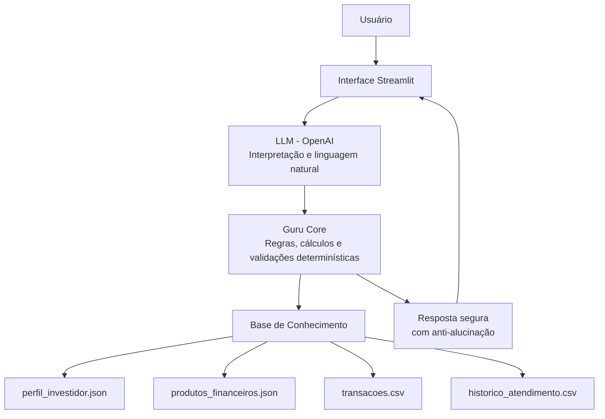

# 🤖 Guru — Agente Financeiro Inteligente com IA

> Assistente financeiro educacional que combina **IA generativa**,  
> **dados estruturados** e **cálculos determinísticos** para apoiar decisões financeiras
> de forma **segura, transparente e personalizada**.

---

## Visão Geral

O **Guru** é um protótipo de agente financeiro conversacional desenvolvido no contexto do bootcamp **Bradesco GenIA & Dados (DIO)**.

A solução demonstra como a **IA pode evoluir de chatbots reativos para assistentes financeiros consultivos**, integrando:

- linguagem natural via **LLM (OpenAI)**  
- base de conhecimento estruturada (**JSON/CSV**)  
- **simulações financeiras determinísticas** em Python  
- mecanismos explícitos de **segurança contra alucinações**

O resultado é uma experiência digital que permite ao usuário:

- entender sua situação financeira atual  
- calcular metas como **reserva de emergência**  
- estimar **aporte mensal necessário até um prazo**  
- receber explicações claras sobre **produtos compatíveis com seu perfil**  
- obter respostas **confiáveis, sem invenção de dados**

---

## 🏗️ Arquitetura (alto nível)

Fluxo principal do sistema:



---

## Estrutura do Repositório

```
📁 lab-agente-financeiro/
│
├── 📄 README.md
├── 📄 requirements.txt
├── 📄 .env
│
├── 📁 data/                          # Dados mockados para o agente
│   ├── historico_atendimento.csv     # Histórico de atendimentos (CSV)
│   ├── perfil_investidor.json        # Perfil do cliente (JSON)
│   ├── produtos_financeiros.json     # Produtos disponíveis (JSON)
│   └── transacoes.csv                # Histórico de transações (CSV)
│
├── 📁 docs/                          # Documentação do projeto
│   ├── 01-documentacao-agente.md     # Caso de uso e arquitetura
│   ├── 02-base-conhecimento.md       # Estratégia de dados
│   ├── 03-prompts.md                 # Engenharia de prompts
│   ├── 04-metricas.md                # Avaliação e métricas
│   └── 05-pitch.md                   # Roteiro do pitch
│
├── 📁 src/                           # Código da aplicação
│   ├── app.py                         # UI Streamlit
│   └── guru_core.py                   # Lógica do agente
│
├── 📁 assets/                        # Imagens e diagramas
    └── screenshot-chat.png           # Tela principal do Guru

```

