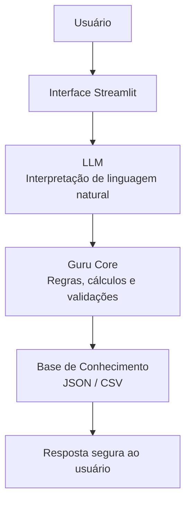

# 🤖 Guru — Assistente Financeiro com IA

> Assistente financeiro inteligente com arquitetura determinística de segurança,  
> integrando LLM, dados financeiros estruturados e mecanismos de prevenção de alucinações  
> para oferecer orientação clara, personalizada e segura.


---

## Visão Geral

O **Guru** é um protótipo de agente financeiro conversacional desenvolvido no contexto do bootcamp **Bradesco GenIA & Dados (DIO)**.

A solução demonstra como a **IA pode evoluir de chatbots reativos para assistentes financeiros consultivos**, integrando:

- linguagem natural via **LLM (OpenAI)**  
- base de conhecimento estruturada (**JSON/CSV**)  
- **simulações financeiras determinísticas** em Python  
- mecanismos explícitos de **segurança contra alucinações**

O resultado é uma experiência digital que permite ao usuário:

- entender sua situação financeira atual  
- calcular metas como **reserva de emergência**  
- estimar **aporte mensal necessário até um prazo**  
- receber explicações claras sobre **produtos compatíveis com seu perfil**  
- obter respostas **confiáveis, sem invenção de dados**

---

## 🏗️ Arquitetura (alto nível)

Fluxo principal do sistema:



---

### Princípio central

> **LLM não decide números.  
> O código determinístico garante a verdade dos dados.**

Esse padrão é utilizado para evitar alucinação.

---

## Funcionalidades Principais

### Planejamento financeiro

- Cálculo do valor faltante para a **reserva de emergência**
- Estimativa de **quanto guardar por mês até um prazo**
- Consideração automática do **perfil de risco do cliente**

### Consulta de dados do perfil

- Patrimônio total  
- Renda mensal  
- Perfil do investidor  

### Educação financeira

- Explicação de produtos do catálogo  
- Orientações sem promessas de retorno  
- Respostas com **disclaimer educacional obrigatório**

### Segurança contra alucinação

- Respostas baseadas **somente na base local**
- Recusa explícita a dados inexistentes (ex.: score de crédito)
- Fallback determinístico caso o LLM falhe

---

## Tecnologias Utilizadas

- **Python**
- **Streamlit** (interface conversacional)
- **OpenAI API** (LLM)
- **Pandas**
- **JSON / CSV** (base de conhecimento)
- **Dateutil** (cálculos de prazo)

---

## Estrutura do Projeto

```
📁 lab-agente-financeiro/
│
├── 📄 README.md
├── 📄 requirements.txt
│
├── 📁 data/                          # Dados mockados para o agente
│   ├── historico_atendimento.csv     # Histórico de atendimentos (CSV)
│   ├── perfil_investidor.json        # Perfil do cliente (JSON)
│   ├── produtos_financeiros.json     # Produtos disponíveis (JSON)
│   └── transacoes.csv                # Histórico de transações (CSV)
│
├── 📁 docs/                          # Documentação do projeto
│   ├── 01-documentacao-agente.md     # Caso de uso e arquitetura
│   ├── 02-base-conhecimento.md       # Estratégia de dados
│   ├── 03-prompts.md                 # Engenharia de prompts
│   ├── 04-metricas.md                # Avaliação e métricas
│   └── 05-pitch.md                   # Roteiro do pitch
│
├── 📁 src/                           # Código da aplicação
│   ├── app.py                         # UI Streamlit
│   ├── guru_core.py                   # Lógica do agente
│   └── llm_client.py                  # Cliente de LLM (OpenAI) e prompt do sistema
│
├── 📁 assets/                        # Imagens e diagramas
    └── screenshot-chat.png           # Tela principal do Guru


```
---

## Exemplos de Perguntas

- **Quanto falta para minha reserva?**
- **Quanto preciso guardar por mês até 2026-06?**
- **Qual meu patrimônio total?**
- **Explique Tesouro Selic**
- **Qual meu score de crédito?** → resposta segura sem alucinação

---

## Avaliação de Qualidade

O **Guru** foi projetado com foco em:

- **Precisão dos cálculos** (valores determinísticos em Python)
- **Coerência com o perfil do cliente** (filtro de produtos por risco/objetivo)
- **Respostas seguras sem invenção de dados** (anti-alucinação e recusa quando não há informação)
- **Clareza na comunicação financeira** (explicações objetivas + disclaimer)

---

## Demonstração

### Interface do Guru


### Cálculo da reserva de emergência


### Simulação de aporte mensal


### Resposta segura sem alucinação


---

## Evoluções Futuras

- Análise automática de gastos por categoria (a partir de `transacoes.csv`)
- Recomendações financeiras personalizadas com base no histórico do cliente
- Memória conversacional persistente (contexto entre sessões)
- Integração com múltiplos LLMs (OpenAI / modelos locais)
- Deploy em ambiente cloud (ex.: Azure / AWS)

---

## Autor

Projeto desenvolvido por **Ramon**  
no contexto do bootcamp **Bradesco GenIA & Dados — DIO**.

