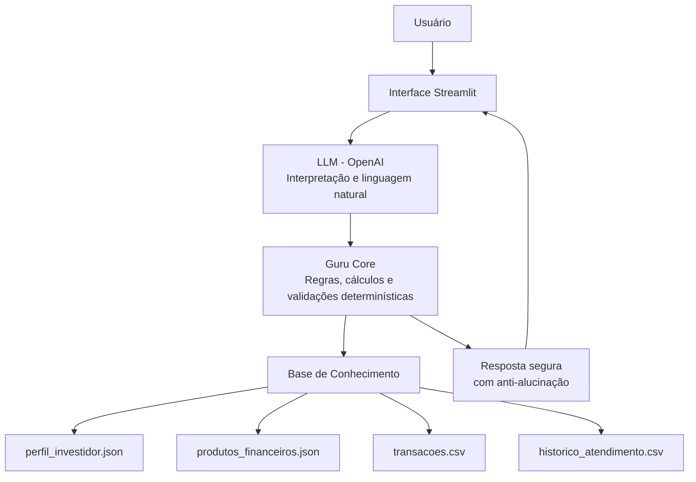

# Documentação do Agente — Guru

## Caso de Uso

### Problema
Muitos clientes possuem informações financeiras dispersas — como transações, metas, perfil de risco e produtos disponíveis — mas enfrentam dificuldade em transformar esses dados em decisões simples do dia a dia, como:

- quanto falta para atingir uma reserva de emergência;
- quanto guardar por mês para cumprir uma meta;
- quais produtos financeiros são compatíveis com seu perfil;
- como compreender conceitos financeiros sem linguagem técnica.

Além disso, assistentes financeiros tradicionais costumam ser **reativos** e podem gerar respostas **imprecisas ou genéricas** quando não possuem dados suficientes, reduzindo a confiança do usuário.

---

### Solução
O **Guru** é um agente financeiro inteligente que combina:

- **interpretação de linguagem natural via LLM (OpenAI)**;
- **base de conhecimento estruturada local (JSON/CSV)**;
- **cálculos determinísticos em Python** para simulações financeiras;
- **recomendações compatíveis com perfil e objetivo do cliente**;
- **mecanismos explícitos de segurança contra alucinações**.

Nesse modelo, a LLM é utilizada apenas para **compreensão e comunicação**, enquanto:

> **números, regras e decisões permanecem sob controle determinístico do código.**

Assim, o Guru transforma dados financeiros em **orientações claras, seguras e personalizadas**, atuando de forma **consultiva, educativa e confiável**.

---

### Público-Alvo
O agente é direcionado a:

- pessoas que desejam organizar a vida financeira;
- investidores iniciantes ou intermediários;
- usuários que precisam de orientação simples para metas financeiras;
- instituições financeiras interessadas em **atendimento digital consultivo com IA segura**.

---

## Persona e Tom de Voz

### Nome do Agente
**Guru**

---

### Personalidade
O Guru apresenta comportamento:

- **consultivo** — orienta sem impor decisões;
- **educativo** — explica conceitos de forma simples;
- **prudente** — evita promessas de rentabilidade;
- **proativo** — sugere caminhos com base no contexto do cliente;
- **seguro** — admite limitações quando a informação não está disponível.

---

### Tom de Comunicação

- **claro e acessível**, sem jargões técnicos;
- **profissional e confiável**, inspirado em bancos digitais;
- **objetivo**, com respostas diretas e úteis;
- **transparente**, explicitando limites de conhecimento.

---

### Exemplos de Linguagem

**Saudação:**  
> “Olá! Posso te ajudar a entender sua reserva, metas ou produtos financeiros.”

**Confirmação:**  
> “Entendi sua meta. Vou calcular quanto falta e sugerir caminhos seguros.”

**Erro / Limitação:**  
> “Não tenho essa informação na minha base no momento, mas posso te ajudar com sua reserva, metas ou produtos disponíveis.”

---

## Arquitetura

### Diagrama (visão conceitual)

---

### Componentes

| Componente                 | Descrição                                                                    |
| -------------------------- | ---------------------------------------------------------------------------- |
| **Interface**              | Chat interativo desenvolvido em Streamlit                                    |
| **LLM (OpenAI)**           | Responsável por compreender perguntas e gerar respostas em linguagem natural |
| **Guru Core**              | Motor determinístico em Python com regras, cálculos e validações             |
| **Base de Conhecimento**   | Arquivos locais JSON/CSV com perfil, transações, histórico e produtos        |
| **Módulo de Cálculo**      | Funções determinísticas para metas, reservas e simulações                    |
| **Validação de Segurança** | Regras anti-alucinação e controle de escopo de respostas                     |

---

## Segurança e Anti-Alucinação

### Estratégias Adotadas

- O Guru **só responde com base nos dados fornecidos** na base local.
- A LLM não decide números nem regras financeiras — apenas comunica resultados.
- A LLM não tem acesso direto aos dados; recebe apenas contexto estruturado controlado pelo Guru Core.
- Cálculos são realizados por funções determinísticas em Python.
- Quando a informação não existe, o agente responde explicitamente:
  > “Não tenho essa informação na minha base.”
- Recomendações respeitam:
  - perfil de risco do cliente;
  - objetivo financeiro declarado.
- Todas as respostas incluem aviso educativo:
  > “Conteúdo educacional, não é recomendação financeira formal.”

---

### Limitações Declaradas

O Guru **não**:

- acessa dados bancários reais ou informações externas;
- fornece recomendações financeiras personalizadas com validade legal;
- garante rentabilidade ou desempenho de investimentos;
- substitui um consultor financeiro humano;
- responde perguntas fora da base de conhecimento disponível;
- executa operações financeiras ou movimentações de conta.

